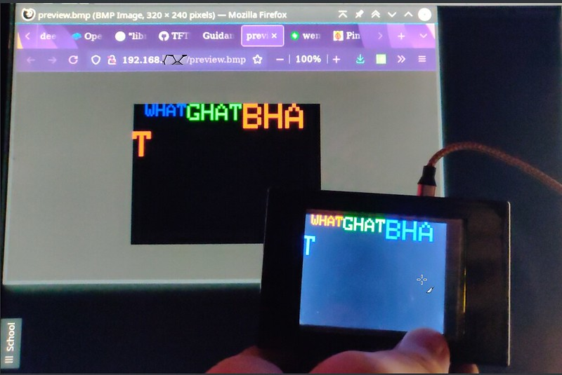

# Remote control LCD display on ESP8266 with Web hits

Hits to the esp's webserver at http://{ip}/cs? let you send text, colors, boxes, etc. to display.

### Some commands (which are sent as web parameters, and may be appended):

```
cls=r=100          # Clears the screen with a dark red background
txt=t=Hello+World  # Displays text, using the current
                   #  self-advancing cursor position
txt=x=0,t=Hello+World  # Picks an x position (y will also be 0 now)
                       #  and displays text
```

### Initial test image during development of web-preview

The web hit will load, live, a preview of what's on the LCD.  The RGB and BGR is reversed here (a bug I've not yet fixed).



### Full hit example:

```
curl 'http://192.168.1.10/cs?cls=r=100&col=r=200,g=300,b=250&frect=50,50,50,20,5&col=r=30,g=230&frect=100,100,80,30,1&col=b=230&frect=180,180,40,50,10&txt=s=1,t=Hello,x=0&tfg=r=225,b=255&txt=s=2,t=World,x=30,y=30&tfg=r=255,g=255&txt=s=3,t=+Over+there'
```

That command:

1. Clears the screen with a bg of red
2. Sets the color, for the next rectangle-drawing operation, to those rgb values
3. Draws a rectangle (frect=x,y,width,height,corner\_radius)
4. Sets color... draws another rectangle...
5. txt= sets a scale of 1 for the text.
6. tfg= sets the rgb for the next text (foreground) color

### Current commands:

```
txt=x=#,y=#,s=#,t=String   (x,y,s optional)
tfg=r=#,g=#,b=#            (r,g,b optional (sort of). Default to 0 if not specified)
font=...                   Not implemented. Will use Adafruit\_GFX font stuff
cls=r=#,g=#,b=#            (r,g,b optional)
px=x=#,y=#                 Not implemented
frect=#,#,#,#,#            x,y,width,height,radius (all required I think)
off                        Not implemented. (Turn off display)
                           (My adaptor board currently feeds HIGH to the LCD on
                           pin so I can't test this functionality yet).
```

## Setup
1. Copy wifi\_config--example.h to wifi\_config.h and put your settings in there
2. Grab [https://github.com/jaggzh/Adafruit_ILI9341esp_read](https://github.com/jaggzh/Adafruit_ILI9341esp_read) -- Your LCD needs a ram read function. I modified the above ESP8266-augmented Adafruit\_ILI9341 graphics library, and I put it at: ~/Arduino/libraries/Adafruit\_ILI9341esp/
3. This ^ library works with the ESP8266 and ILI9341 boards, but, again, that RAMRD function might be specific to this TJCTM24028-SPI LCD.

## See also

* [https://github.com/jaggzh/Adafruit_ILI9341esp_read](https://github.com/jaggzh/Adafruit_ILI9341esp_read) (See Setup above)
* This includes a copy of [Jaggz's BMP Secretion Library](https://github.com/jaggzh/lib-secrete-bmp) (a memory-efficient pixel-by-pixel or row-by-row generation of BMP images). You don't need to download it; it's in here.
* For convenience, I designed an adapter board going between the LCD and the ESP8266 [ILI9341 / TJCTM24028-SPI - ESP8266 Adapter Board](https://oshpark.com/shared_projects/dopTFnBT).
* The enclosure needs some work so I've not published it yet. Sorry.


